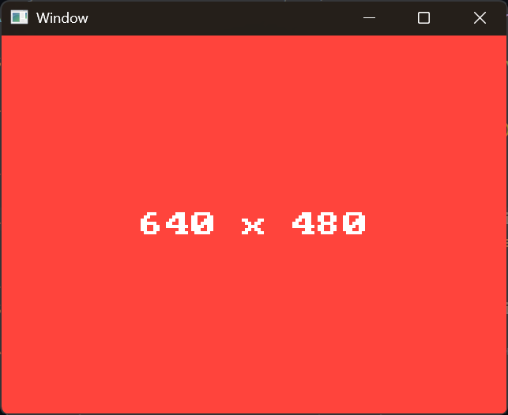

# Window

Well, nothing special to see here. 
It's just the classical SDL Window creation example.



## SDL3 Main Callbacks – the new entry point model

Instead of a classic `main()` with a hand-written event loop, this demo uses the **SDL3 Main Callbacks** system:

```c
#define SDL_MAIN_USE_CALLBACKS
#include <SDL3/SDL_main.h>
```

SDL3 will then automatically call four functions that you implement:

| Function | When called | Purpose |
|---|---|---|
| `SDL_AppInit()` | Once at startup | Initialize window, renderer, and Nuklear |
| `SDL_AppEvent()` | Per SDL event | Forward events to Nuklear |
| `SDL_AppIterate()` | Every frame | Define and render the GUI |
| `SDL_AppQuit()` | On exit | Clean up resources |

The return value controls the app flow: `SDL_APP_CONTINUE` keeps running, `SDL_APP_SUCCESS` exits cleanly, `SDL_APP_FAILURE` aborts with an error.

The callbacks allow compilation to the Web via emscripten without adding `#ifdef` expressions.
