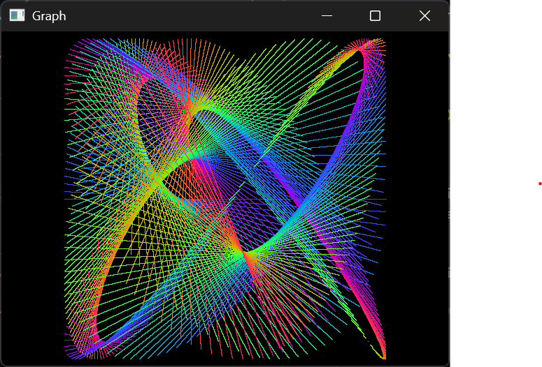

# Graph

This draws a couple primitive lines onto the window and animates them using sine and cosine
functions. The arrangement of the lines shape various lissajous figures.



The main callbacks are moved to a C++ class [`GraphApp`](graph-app.hpp).

In the Iterate callback, SDL3 provides a `SDL_RenderLine` function:

```c
for (int i = 0; i < 360; i++){
    // ... calculations
    SDL_SetRenderDrawColorFloat(renderer, red, green, blue, SDL_ALPHA_OPAQUE_FLOAT);
    SDL_RenderLine(renderer, x1, y1, x2, y2);
}
```

This itself doesn't reander anything onscreen, but `SDL_RenderPresent` does it:

```c
SDL_RenderPresent(_renderer);
```

