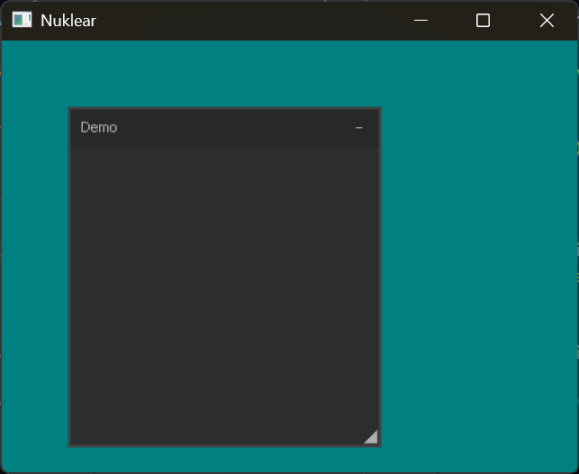

# Nuklear + SDL3 Renderer – Documentation

Based on `demo/sdl3_renderer/` from the [Nuklear repository](https://github.com/Immediate-Mode-UI/Nuklear).




## What is Nuklear?

Nuklear is an **immediate-mode GUI library** written in ANSI C — a single header file (`nuklear.h`). This means there is no widget state stored inside the library. You describe the GUI **every frame from scratch** and Nuklear renders it. State like "is this checkbox checked?" lives with **you** — in your own variables.

> **Golden rule:** There is no `nk_button_create()` followed later by `nk_button_draw()`. Instead: `if (nk_button_label(ctx, "Click me")) { /* was clicked */ }` — everything in one call, every frame.

## Phase 1: Initialization (`SDL_AppInit`)

### 1.1 Start SDL and create the window

```c
SDL_Init(SDL_INIT_VIDEO | SDL_INIT_EVENTS);

SDL_CreateWindowAndRenderer(
    "Nuklear: SDL3 Renderer",
    WINDOW_WIDTH, WINDOW_HEIGHT,
    SDL_WINDOW_RESIZABLE,
    window,
    renderer
);

SDL_SetRenderVSync(renderer, 1); // Enable VSync
```

### 1.2 HiDPI / Display scale

On Retina or HiDPI displays the renderer is scaled so the UI doesn't appear tiny:

```c
const float scale = SDL_GetWindowDisplayScale(app->window);
SDL_SetRenderScale(renderer, scale, scale);
float font_scale = scale; // Remember for font baking
```

> **Note:** When the scale changes (e.g. dragging the window to a different monitor), SDL fires `SDL_EVENT_WINDOW_DISPLAY_SCALE_CHANGED`. The demo only logs a warning here — in a real app you would need to re-bake the font when this happens.

### 1.3 Initialize Nuklear

```c
struct nk_context *ctx = nk_sdl_init(window, renderer, nk_sdl_allocator());
```

`nk_sdl_allocator()` is an SDL-native allocator (using `SDL_malloc`/`SDL_free`). Preferable to `NK_INCLUDE_DEFAULT_ALLOCATOR` because it is more portable.

### 1.4 Font baking

Nuklear renders fonts itself — they must be "baked" into a texture once at startup:

```c
struct nk_font_atlas *atlas;
struct nk_font_config config = nk_font_config(0);
struct nk_font *font;

atlas = nk_sdl_font_stash_begin(ctx);          // Prepare the atlas
font = nk_font_atlas_add_default(atlas, 13 * font_scale, &config); // Built-in font
// Or load your own TTF:
// font = nk_font_atlas_add_from_file(atlas, "MyFont.ttf", 16 * font_scale, &config);
nk_sdl_font_stash_end(ctx);                    // Upload texture to GPU

// HiDPI hack: scale the font height back down so layouts are calculated correctly
font->handle.height /= font_scale;

nk_style_set_font(ctx, &font->handle);         // Activate the font
```

### 1.5 Input initialization

```c
nk_input_begin(ctx); // Start the first input collection cycle
```

This call must happen **before** the first event loop iteration. During normal operation it runs at the **end** of `SDL_AppIterate`.

## Phase 2: Event handling (`SDL_AppEvent`)

Inside the `HandleEvent` method, invoked by `SDL_AppEvent`, a switch
statement takes care of handling the events:

```c
switch (event->type) {
    case SDL_EVENT_QUIT:
        return SDL_APP_SUCCESS;
    case SDL_EVENT_KEY_DOWN:
        if (event->key.key == SDLK_Q && event->key.mod & SDL_KMOD_CTRL)
            return SDL_APP_SUCCESS;
        break;
}
```

**Critical point:** `SDL_ConvertEventToRenderCoordinates()` must be called **before** `nk_sdl_handle_event()` because the renderer uses a custom scale. Without this conversion, mouse click positions will not match what is visible on screen.

---

## Phase 3: Frame loop (`SDL_AppIterate`)

This is the heart of the application — everything happens here every frame:

First, the input collection since the previous screen is closed:

```c
nk_input_end(ctx);
```

Then, the UI is defined. The following code defines an empty window:

```c
if (nk_begin(ctx, "Demo", nk_rect(50, 50, 230, 250),
    NK_WINDOW_BORDER | NK_WINDOW_MOVABLE | NK_WINDOW_SCALABLE |
    NK_WINDOW_MINIMIZABLE | NK_WINDOW_TITLE))
{
    // ... widgets go here ...
}
nk_end(ctx);
```


The UI is rendered using the `nk_sdl_*` helper functions defined in `nuklear_sdl_renderer.h`:

```c
// Win95-like Background :D
SDL_SetRenderDrawColorFloat(renderer, 0.0f, 0.5f, 0.5f, 1.0f);
SDL_RenderClear(renderer);

nk_sdl_render(ctx, useAntiAliasing);
nk_sdl_update_TextInput(ctx);

SDL_RenderPresent(renderer);
```

At the end of the AppIterate function, input collection is 
started again.


```c
nk_input_begin(ctx);
```

## Widget reference from the demo

### Opening and closing windows

```c
if (nk_begin(ctx, "Window Name", nk_rect(x, y, width, height), flags)) {
    // widgets go here
}
nk_end(ctx); // ALWAYS call this, even if nk_begin returned false
```

**Common flags:**

| Flag | Meaning |
|---|---|
| `NK_WINDOW_BORDER` | Draw a border |
| `NK_WINDOW_MOVABLE` | User can drag the window |
| `NK_WINDOW_SCALABLE` | User can resize the window |
| `NK_WINDOW_MINIMIZABLE` | User can minimize the window |
| `NK_WINDOW_TITLE` | Show a title bar |

### Layout rows

A layout must be declared before each group of widgets:

```c
// Static: 1 widget, 80px wide, 30px tall
nk_layout_row_static(ctx, 30, 80, 1);

// Dynamic: 2 widgets sharing the available width equally
nk_layout_row_dynamic(ctx, 30, 2);
```

### Button

```c
if (nk_button_label(ctx, "button")) {
    SDL_Log("button pressed"); // Executes when clicked
}
```

### Radio buttons (options)

```c
enum { EASY, HARD };
static int op = EASY;

nk_layout_row_dynamic(ctx, 30, 2);
if (nk_option_label(ctx, "easy", op == EASY)) op = EASY;
if (nk_option_label(ctx, "hard", op == HARD)) op = HARD;
```

The second parameter is the "active" state — you do the comparison yourself.

### Integer property (slider with number input)

```c
static int property = 20;
nk_layout_row_dynamic(ctx, 25, 1);
nk_property_int(ctx, "Compression:", 0, &property, 1000, 1, 1);
//                    label          min  value*     max  step  pixelsPerStep
```

### Label

```c
nk_layout_row_dynamic(ctx, 20, 1);
nk_label(ctx, "background:", NK_TEXT_LEFT);
// Alignment options: NK_TEXT_LEFT, NK_TEXT_CENTERED, NK_TEXT_RIGHT
```

### Combo box with color picker

```c
if (nk_combo_begin_color(ctx, nk_rgb_cf(app->bg), nk_vec2(widget_width, 400))) {
    nk_layout_row_dynamic(ctx, 120, 1);
    app->bg = nk_color_picker(ctx, app->bg, NK_RGBA);

    nk_layout_row_dynamic(ctx, 25, 1);
    app->bg.r = nk_propertyf(ctx, "#R:", 0, app->bg.r, 1.0f, 0.01f, 0.005f);
    app->bg.g = nk_propertyf(ctx, "#G:", 0, app->bg.g, 1.0f, 0.01f, 0.005f);
    app->bg.b = nk_propertyf(ctx, "#B:", 0, app->bg.b, 1.0f, 0.01f, 0.005f);
    app->bg.a = nk_propertyf(ctx, "#A:", 0, app->bg.a, 1.0f, 0.01f, 0.005f);

    nk_combo_end(ctx);
}
```

`nk_rgb_cf()` converts `nk_colorf` → `nk_color` for display on the combo button.  
`nk_widget_width(ctx)` returns the current widget width — useful for responsive dropdowns.

---

## Phase 4: Cleanup (`SDL_AppQuit`)

```c
void SDL_AppQuit(void *appstate, SDL_AppResult result) {
    struct nk_sdl_app* app = (struct nk_sdl_app*)appstate;
    if (app) {
        nk_input_end(app->ctx);       // Close the open input block
        nk_sdl_shutdown(app->ctx);    // Free Nuklear, atlas, and textures
        SDL_DestroyRenderer(app->renderer);
        SDL_DestroyWindow(app->window);
        SDL_free(app);
    }
}
```

---

## Defines: what must/can I set?

### Required (for sdl3_renderer)

```c
#define NK_INCLUDE_COMMAND_USERDATA       // For renderer extensions
#define NK_INCLUDE_VERTEX_BUFFER_OUTPUT   // Vertex-based rendering
```

### Optional but recommended

```c
#define NK_INCLUDE_FONT_BAKING    // TTF font support
#define NK_INCLUDE_DEFAULT_FONT   // Built-in fallback font
#define NK_INCLUDE_STANDARD_VARARGS
#define NK_INCLUDE_STANDARD_IO
```

### SDL integration (instead of built-in implementations)

```c
// Use SDL types instead of NK_INCLUDE_FIXED_TYPES
#define NK_INT8  Sint8
#define NK_UINT8 Uint8
// ... (see main.c for the full list)

// Use SDL functions instead of libc
#define NK_ASSERT(c)      SDL_assert(c)
#define NK_MEMSET(d,c,l)  SDL_memset(d,c,l)
#define NK_MEMCPY(d,s,l)  SDL_memcpy(d,s,l)
#define NK_SIN(f)         SDL_sinf(f)
#define NK_COS(f)         SDL_cosf(f)
```

### Activating the implementation (once, in exactly one .c file)

```c
#define NK_IMPLEMENTATION
#include "nuklear.h"

#define NK_SDL3_RENDERER_IMPLEMENTATION
#include "nuklear_sdl3_renderer.h"
```

> **Warning:** These two `_IMPLEMENTATION` defines may only appear in **one** translation unit. Include the headers in other `.c` files without the define.

## Common pitfalls

| Problem | Cause | Fix |
|---|---|---|
| Mouse clicks hit the wrong spot | `SDL_ConvertEventToRenderCoordinates` missing | Call it before `nk_sdl_handle_event` |
| Forgot `nk_end` | Nuklear state becomes corrupt | **Always** call `nk_end` after `nk_begin`, even if `nk_begin` returned false |
| Font too small on HiDPI | `font->handle.height` not adjusted | After `stash_end`: `font->handle.height /= font_scale` |
| Text fields not working | `nk_sdl_update_TextInput` missing | Call it after `nk_sdl_render` |
| `NK_IMPLEMENTATION` defined multiple times | Linker error (duplicate symbols) | Only define it in one `.c` file |
| Input cycle out of order | `nk_input_begin`/`end` incorrectly nested | End of iterate: `begin`; start of iterate: `end` |


*Documentation based on `demo/sdl3_renderer/main.c` — Nuklear repository (Immediate-Mode-UI/Nuklear)*

## Further documentation

This article is about using Nuklear in LWJGL and Java.
It is nicely documented and can be adapted directly: 
<https://www.thecodingfox.com/nuklear-usage-guide-lwjgl>

